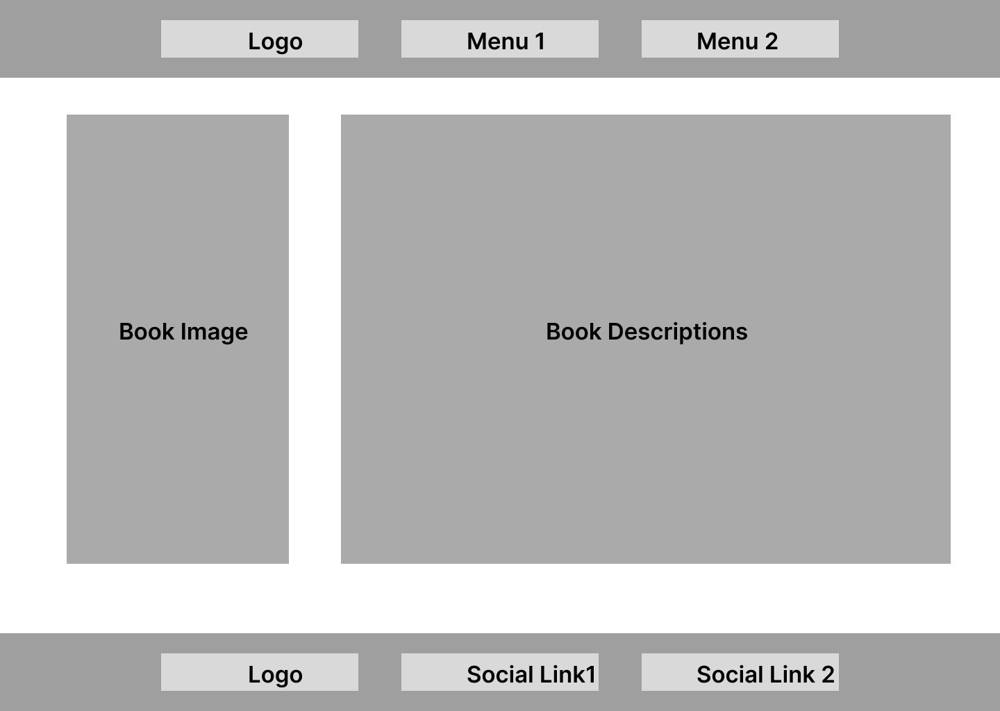
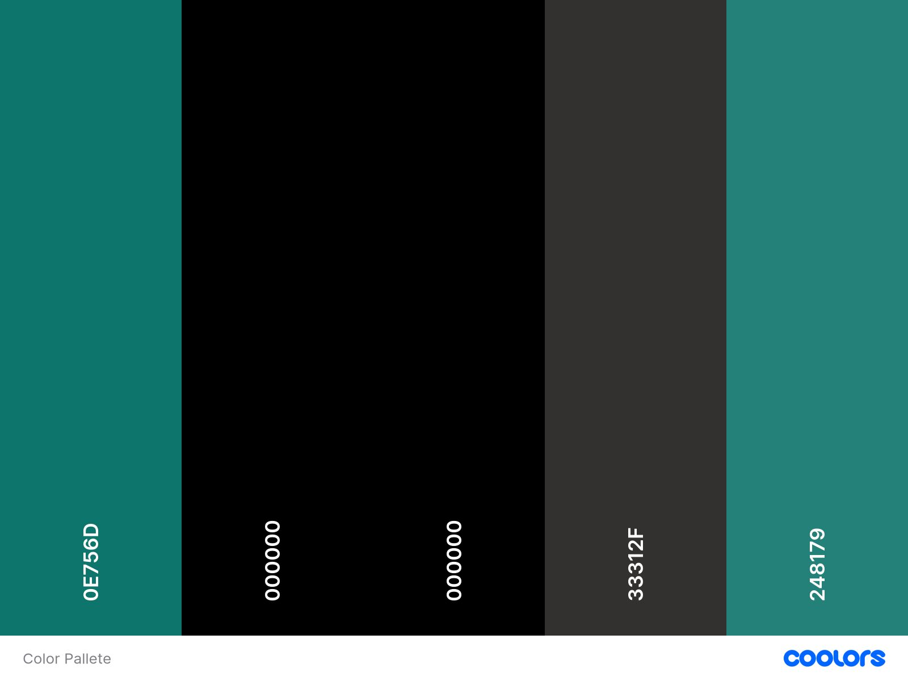

# Objective

The aim of this project is to deliver a professionaly developed website for users to access a friendly but professional bookstore.

[Back to top](<#contents>)

# User Experience (UX)

## Target Audience

* Users who has intersts for books.
* Users who has interested to know about the overview latest books.

## User Stories

* A user should able to easily see what the website is for.
* A user should be able to easily navigate the site
* A user should be able to see the contents

## Site Aims

* To show the overview of a particular book
* To offer a easy access to contact with the seller
* To sell the business to the user in a warm, friendly and inviting manner
* To deliver the cost of a book

## Design Wireframes

The design and structure for this website was created in Figma. We built the wireframe of the desctop pages only.

 Low Fidelity Wireframes 

## Site Structure

Storyverse consists of 4 page website with 3 pages that the user can navigate between via the navigation bar. By default, the loading page is the Home page. In addition to being centred, the logo is connected to the home page. Two navigation links, [Home] (index.html) and [Books] (books.html), are located on the left side of the logo. Two more navigation links and [Contact] (contact.html), are located on the right side of the logo.

## Design Choices

### Colour Scheme

The Color pallete I use is based on the Dark teal and I use 3 colors for the pallete to introduce the webpage a little more and it also gives the end-user to have passion to read the books.

### Typography

For storyverse we choose the default fonts. Three fonts were tested before but it didn't suits the philosophy.

[Back to top](<#contents>)

# Features

Because Storyverse is organised and styled similarly to a standard website, using it is incredibly easy and natural, encouraging users to explore further.

All pages—aside from the home page—have a headline that is easy to see when you first arrive and a brief paragraph that introduces the content. The design, colour scheme, and language employed are meant to be approachable and simple to comprehend.

## Navigation

* Links to the primary material are located in the navigation menu, which is prominently displayed at the top of the page.

* To maintain the best possible user experience, the navigation bar is available in three distinct screen size variations. All three retain the same colour scheme and design elements, with the exception of the structure.

## Home Page

 * The home page is the landing page of the website. It gives the end-user a feel of welcoming.

 * A sizable hero image is prominently displayed and was picked for its aesthetic, colour scheme, and tone to complement the website. The site name and a memorable slogan are superimposed over the hero image.

 * We have one section for landing page which helps the end user to navigate to the books page.

 

 

Mobile Home Page

 

 

## Books Page

* * The Books page is exactly what its navigation link says it is. It provides a concise list of the books that are offered..

* There is a list of the available books.

* This page is fully responsive

## Book Page

* The book page is not showing in the navbar.

* When an end-user clicks on a book that he or she may like then this page appears.

* It holds the description of a book.

## Contact Page

* The Contact Page is the last page of the website.

* It helps end-user to communicate with the seller

* And also It helps the seller to sell the books.

# Future Features

* We can have more sections in the home to show how the website works or how to give an order of a book/

* The books section can have one filter section up in the front.

* The whole website can be a ecommerce from where anyone can buy the books directly.

# Technologies Used

* HTML5 - Delivers the structure and content for the website.
* CSS3 - Provides the styling for the website.
* Figma - Used to create wireframes for the website
* Github - Used to host and deploy the website.

[Back to top](<#contents>)
