# *StoryVerse - Project Portfolio 1 - HTML & CSS*
Storyverse is a small profesional bookstore which offers a wide range of books. This website is for booklovers and it shows the latest story books.

You can view the live site here - <a href="https://newcoderm.github.io/BookVerse/" target="_blank"> Storyverse </a>

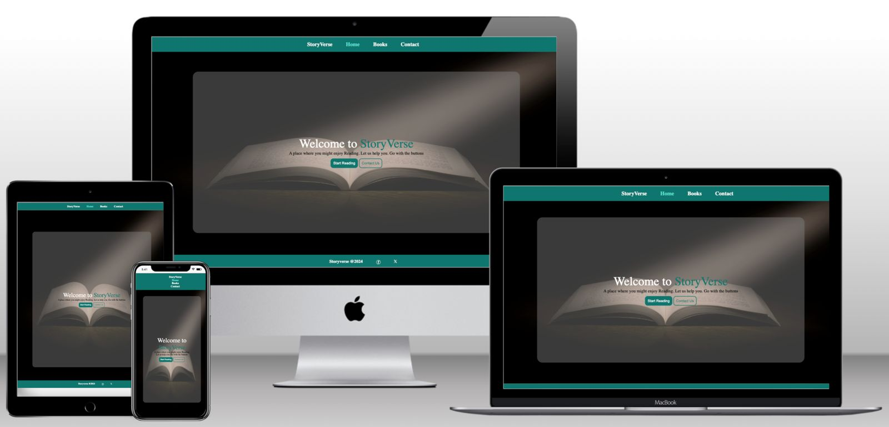

# Contents
- [*StoryVerse - Project Portfolio 1 - HTML \& CSS*](#storyverse---project-portfolio-1---html--css)
- [Contents](#contents)
- [Objective](#objective)
- [User Experience (UX)](#user-experience-ux)
  - [Target Audience](#target-audience)
  - [User Stories](#user-stories)
  - [Site Aims](#site-aims)
  - [Design Wireframes](#design-wireframes)
  - [Site Structure](#site-structure)
  - [Design Choices](#design-choices)
    - [Colour Scheme](#colour-scheme)
    - [Typography](#typography)
- [Features](#features)
  - [Navigation](#navigation)
  - [Home Page](#home-page)
  - [Books Page](#books-page)
  - [Book Page](#book-page)
  - [Contact Page](#contact-page)
- [Future Features](#future-features)
- [Technologies Used](#technologies-used)
- [Testing](#testing)
  - [Code Validation](#code-validation)
  - [Lighthouse Testing](#lighthouse-testing)
  - [Accessibility Testing](#accessibility-testing)
  - [Responsive Testing](#responsive-testing)
  - [Manual Testing](#manual-testing)
  - [Bugs Fixed](#bugs-fixed)
    - [HTML Validation](#html-validation)
    - [CSS Validation](#css-validation)
- [Deployment](#deployment)
- [Credits](#credits)
- [Acknowledgements](#acknowledgements)

# Objective

The aim of this project is to deliver a professionaly developed website for users to access a friendly but professional bookstore.

[Back to top](<#contents>)

# User Experience (UX)

## Target Audience

* Users who has intersts for books.
* Users who has interested to know about the overview latest books.

## User Stories

* A user should able to easily see what the website is for.
* A user should be able to easily navigate the site
* A user should be able to see the contents

## Site Aims

* To show the overview of a particular book
* To offer a easy access to contact with the seller
* To sell the business to the user in a warm, friendly and inviting manner
* To deliver the cost of a book

## Design Wireframes

The design and structure for this website was created in Figma. We built the wireframe of the desctop pages only.

 Low Fidelity Wireframes 

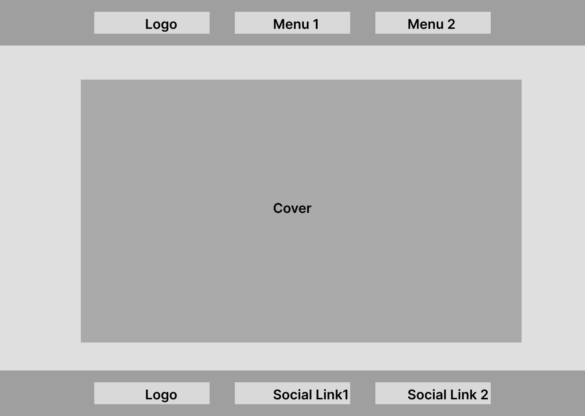

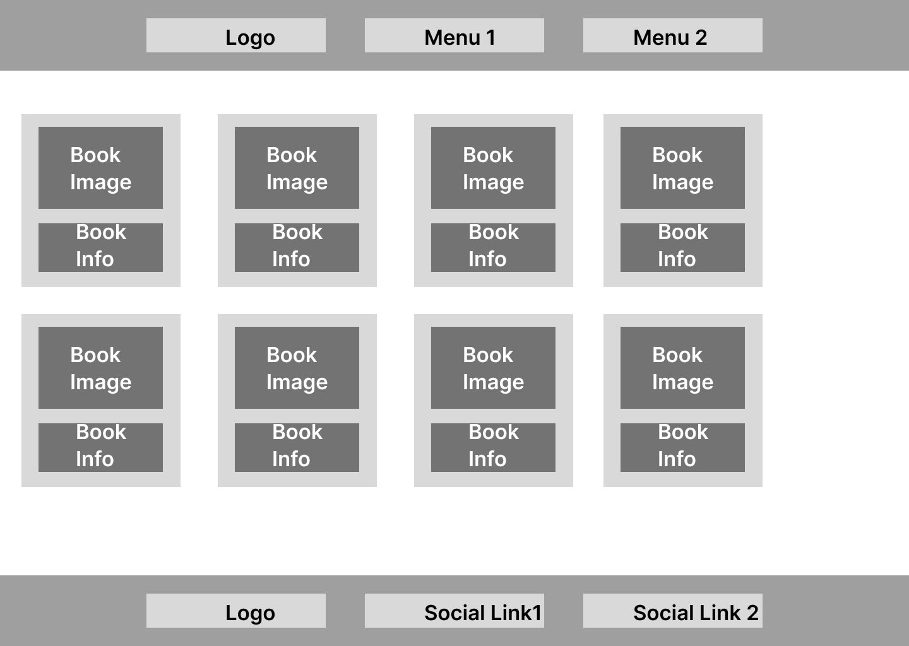

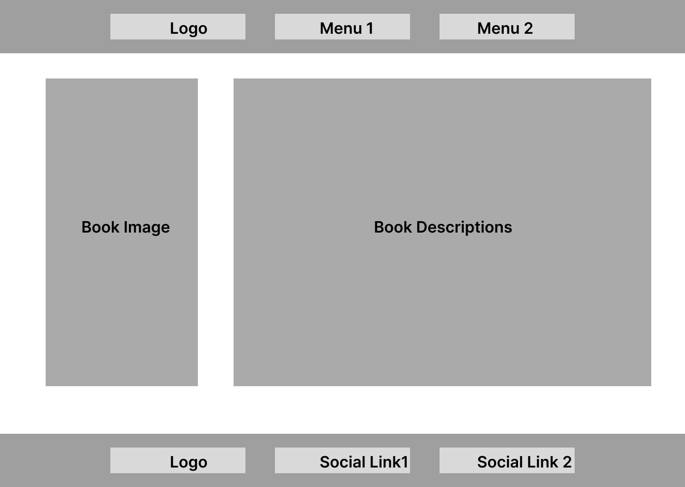

## Site Structure

Storyverse consists of 4 page website with 3 pages that the user can navigate between via the navigation bar. By default, the loading page is the Home page. In addition to being centred, the logo is connected to the home page. Two navigation links, [Home] (index.html) and [Books] (books.html), are located on the left side of the logo. Two more navigation links and [Contact] (contact.html), are located on the right side of the logo.

## Design Choices

### Colour Scheme

The Color pallete I use is based on the Dark teal and I use 3 colors for the pallete to introduce the webpage a little more and it also gives the end-user to have passion to read the books.

### Typography

For storyverse we choose the default fonts. Three fonts were tested before but it didn't suits the philosophy.

[Back to top](<#contents>)

# Features

Because Storyverse is organised and styled similarly to a standard website, using it is incredibly easy and natural, encouraging users to explore further.

All pages—aside from the home page—have a headline that is easy to see when you first arrive and a brief paragraph that introduces the content. The design, colour scheme, and language employed are meant to be approachable and simple to comprehend.

## Navigation

* Links to the primary material are located in the navigation menu, which is prominently displayed at the top of the page.

* To maintain the best possible user experience, the navigation bar is available in three distinct screen size variations. All three retain the same colour scheme and design elements, with the exception of the structure.

## Home Page

 * The home page is the landing page of the website. It gives the end-user a feel of welcoming.

 * A sizable book image is prominently displayed and was picked for its aesthetic, colour scheme, and tone to complement the website. The site name and a memorable slogan are superimposed over the book image.

 * We have one section for landing page which helps the end user to navigate to the books page.

 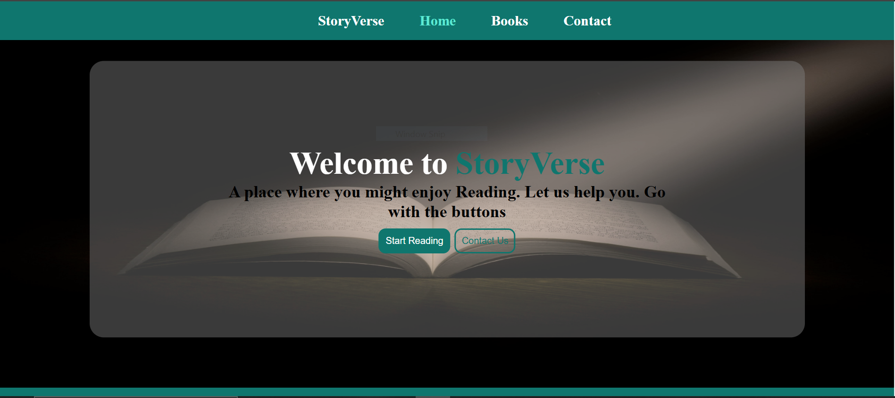

 

Mobile Home Page

 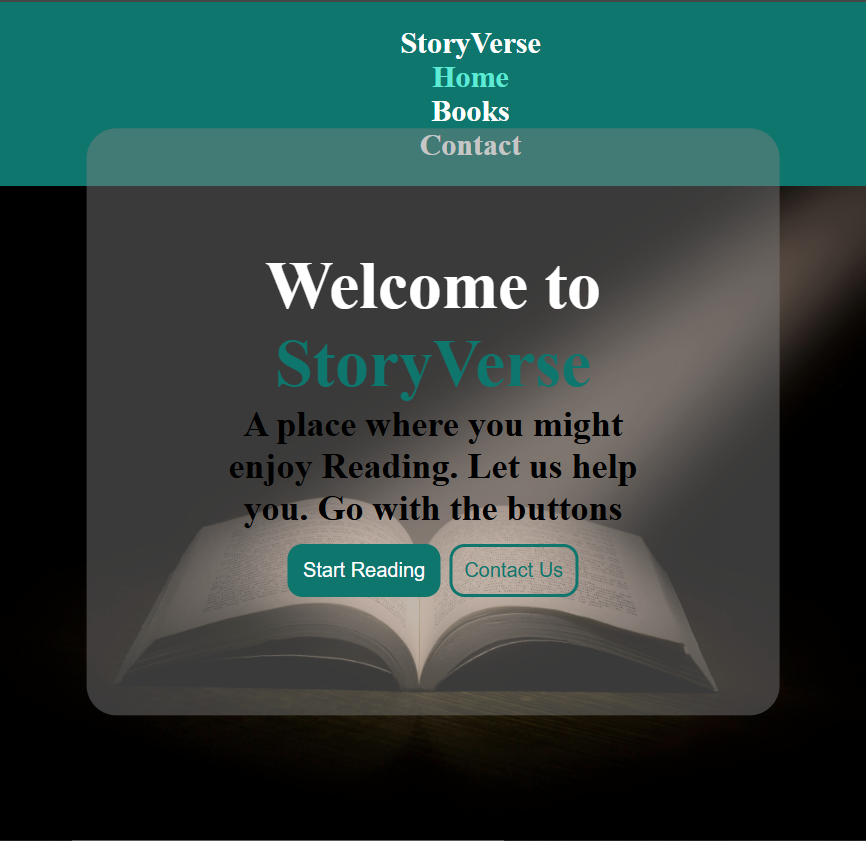

 

## Books Page

* * The Books page is exactly what its navigation link says it is. It provides a concise list of the books that are offered..

* There is a list of the available books.

* This page is fully responsive

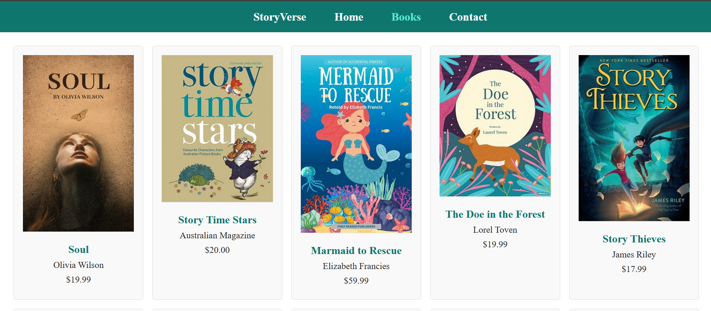

## Book Page

* The book page is not showing in the navbar.

* When an end-user clicks on a book that he or she may like then this page appears.

* It holds the description of a book.

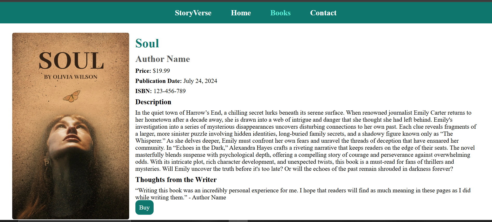

## Contact Page

* The Contact Page is the last page of the website.

* It helps end-user to communicate with the seller

* And also It helps the seller to sell the books.

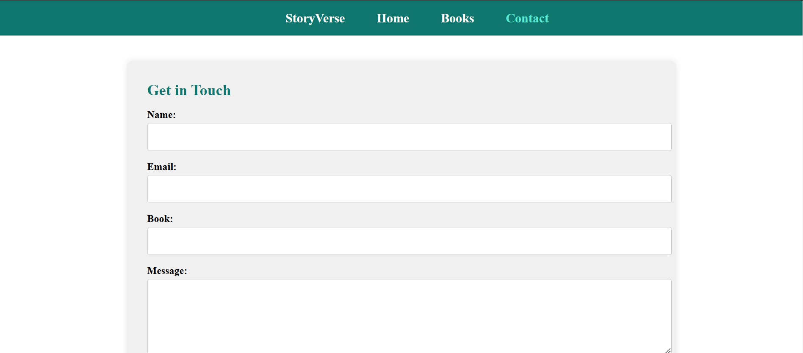

# Future Features

* We can have more sections in the home to show how the website works or how to give an order of a book/

* The books section can have one filter section up in the front.

* The whole website can be a ecommerce from where anyone can buy the books directly.

# Technologies Used

* HTML5 - Delivers the structure and content for the website.
* CSS3 - Provides the styling for the website.
* Figma - Used to create wireframes for the website
* Github - Used to host and deploy the website.

[Back to top](<#contents>)

# Testing

## Code Validation
BookVerse was tested with HTML and CSS validators. With HTML validator it got 8 problems and with CSS Validator, it doesn't have any problems.

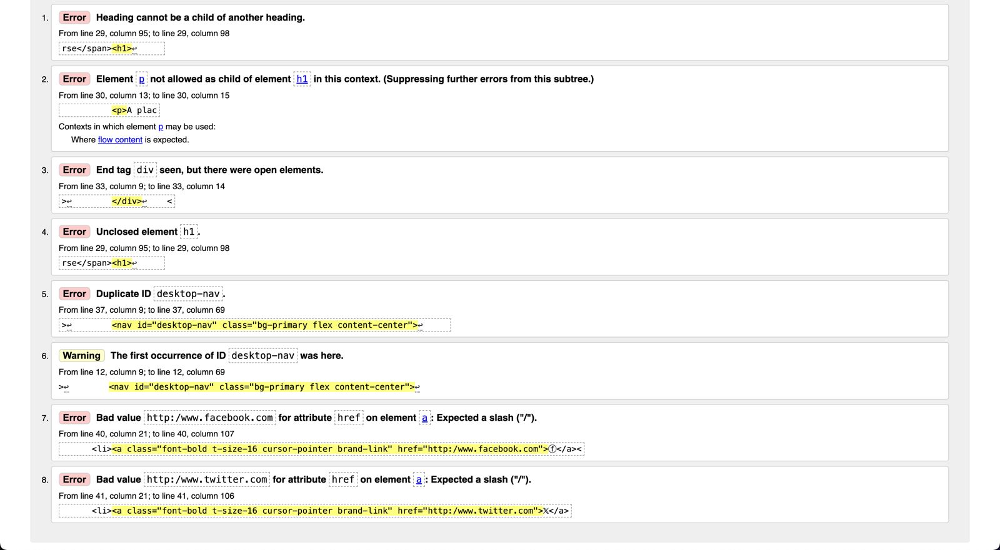

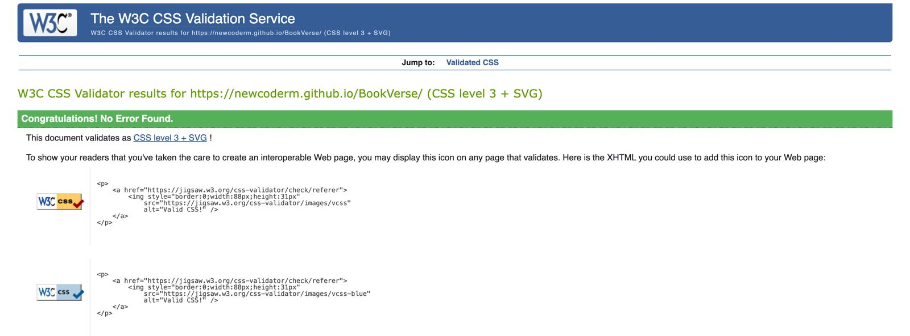

## Lighthouse Testing

The website was also put through Lighthouse testing via Chrome Devtools which tests a site under 4 different headings; Performance, Accessibility, Best Practices and SEO and it tests it under mobile and desktop criteria.

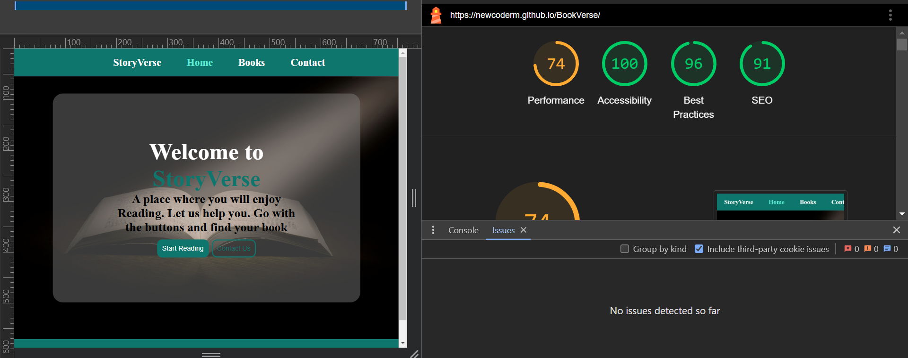

## Responsive Testing

Responsiveness was tested via a few different mediums manually, including Chrome Devtools.

## Manual Testing

In addition to the automated process above, manual testing was carried out on the site as well.

* Naviagtion Menu
    * Verified that all the links are working
    * Verified that the logo is taking to the home page
    * Verified that the navigation bar is full responsive.

* Home Page
    * Verified that the Hero image is responsive
    * Verified that all the buttons are working the page

* Books Page
    * Verified that grids are responsive
    * Verified that it is taking to the particular page
    * Verified that Books description are clearly shown

* Book Page
    * Verfied all the image has alt text
    * Verified that the button is working

* Contact Page
    * Verified that it is can't be submitted with the required inputs
    * Verified that it is responsive

* Footer
    * Verrified that the email asset links properly with the mailto function.
    * Verified that the social media links are all linked properly to the releveant social media home pages.
    * Verified that all the social media links open in a new tab.

* Browser Testing
    * Storyverse is tested on all the browsers
    * Verified that all the images and links are working correctly.
    * Verified that all images worked correctly
      
## Bugs Fixed

### HTML Validation
BookVerse had 8 problems and I managed to fix them.

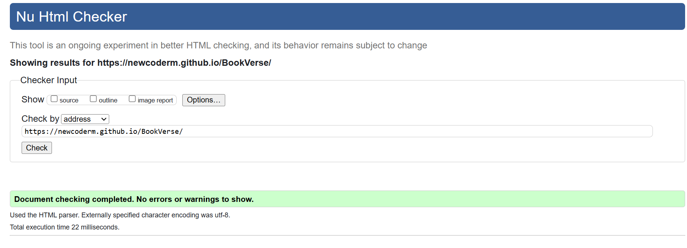

# Deployment

The website was deployed to GitHub pages via the following methods:

1. Navigate to the Settings tab in the GitHub repository for the project.
2. On the left hand side, scroll down to the pages tab.
3. Under the Source tab, choose the branch called Main and in the dropdown beside it select the folder called Root.
4. Click save.
5. The page automatically displays the deployed link at the top once save is clicked.
6. It can take up to 5 minutes to deploy.

[Back to top](<#contents>)

# Credits

* All images from the website were sourced from [Pinterest](https://www.pinterest.de/)
* Colour palette was created by [coolors.co](https://coolors.co/)
* CSS Grid code was learned via [Traversy Media](https://www.youtube.com/watch?v=jV8B24rSN5o&t=7s&ab_channel=TraversyMedia)
  
[Back to top](<#contents>)

# Acknowledgements

This site, BookVerse was designed and developed in conjunction with the Full Stack Software Developer Diploma course at the Code Institute. I would like to thank my mentor, Mr. Spencer Barriball, who has giving valuble advices to finish this project easier and faster than I expected.
I thank my cohort facilitator Kamil for his continuos support. I would also like to thank the student care at CodeInstitute especially Bethany who helped me through my many setbacks at the begining of this course and made reaching this point possible for me.

To all those people...Thankyou ❤

[Back to top](<#contents>)

